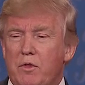

# The Dewy Video Annotator

The [Internet Archive](https://archive.org) have put out a [call for help](https://blog.archive.org/2017/01/05/internet-archives-trump-archive-launches-today/) in "enhanc[ing] search and discovery by collaborating in experiments to apply artificial intelligence-driven facial recognition, voice identification, and other video content analysis approaches" in order to make tracing primary source material feasible.

Our immediate goal is to support (i.e. automate as much as possible) the hyperlinking of conversations to their speakers and topics, similar to what [GovTrack](https://www.govtrack.us/) and [OpenParliament](https://openparliament.ca/) do for the US and Canada already, but from television and radio, rather than formatted text, sources.

## Developing

First get the dependencies with pip; this should work everywhere
but this is alpha code so if you find yourself fighting with this
step please submit fixes.

```
pip install -r requirements.txt
```

To run, you will need some data to play with. We are not committing our corpus to this repo, for copyright and bandwidth pain, so you will need to manually grab some videos with faces and speech in them. The [Trump Archive](http://archive.org/details/trumparchive) is a good place to start; you can also use [`youtube-dl`](https://rg3.github.io/youtube-dl/download.html) to get videos off of [YouTube](https://youtube.com) and [Vimeo](https://vimeo.com).

Once you have a video `clip.mp4`, try
```
$ ./vid_extract_faces clip.mp4
```

It will produce a mess of PNG files in this directory with every face it could detect at each second, like these, produced from [this](http://archive.org/details/KQED_20161020_010000_PBS_NewsHour_Debates_2016_A_Special_Report):

 
